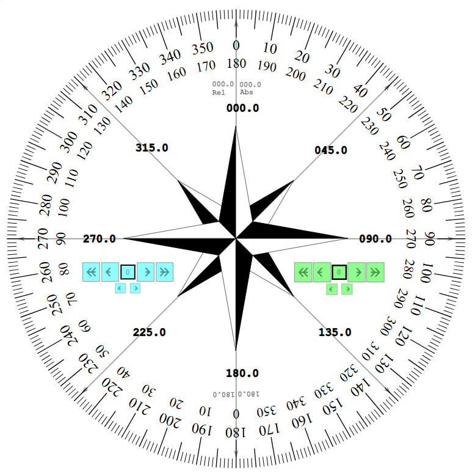
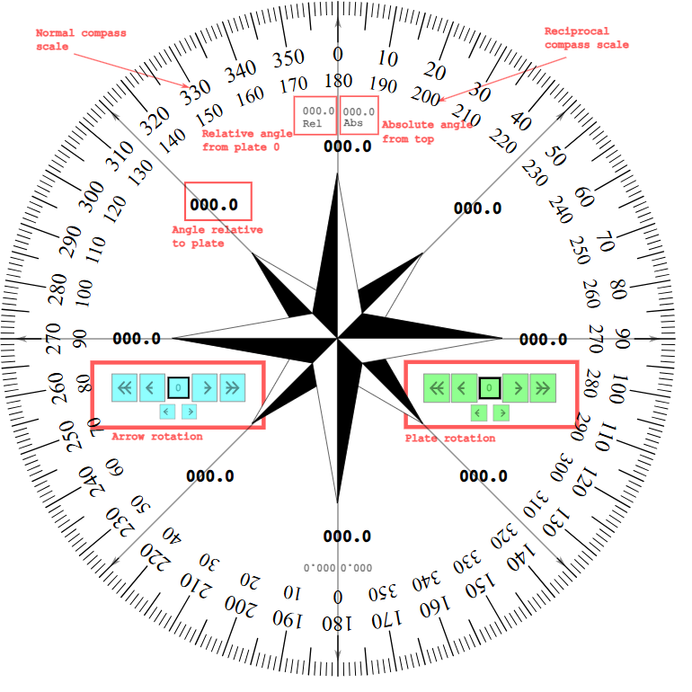
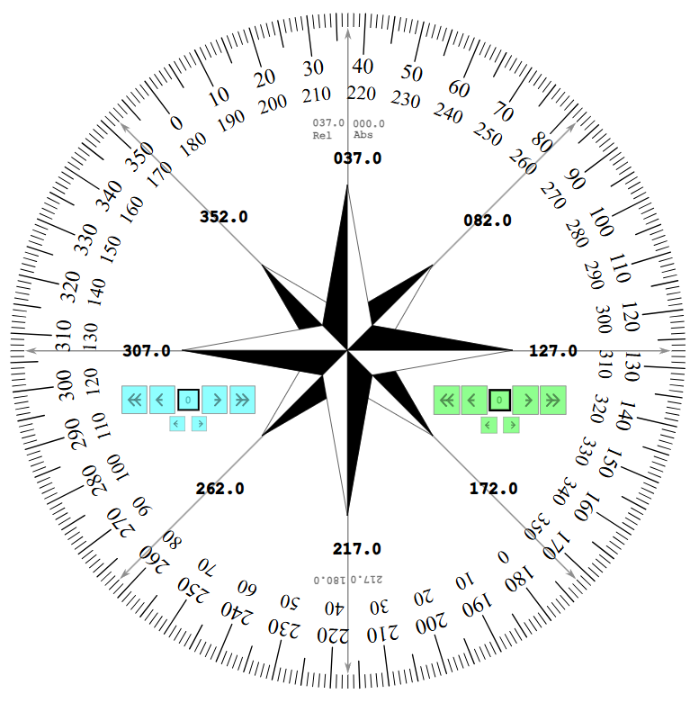
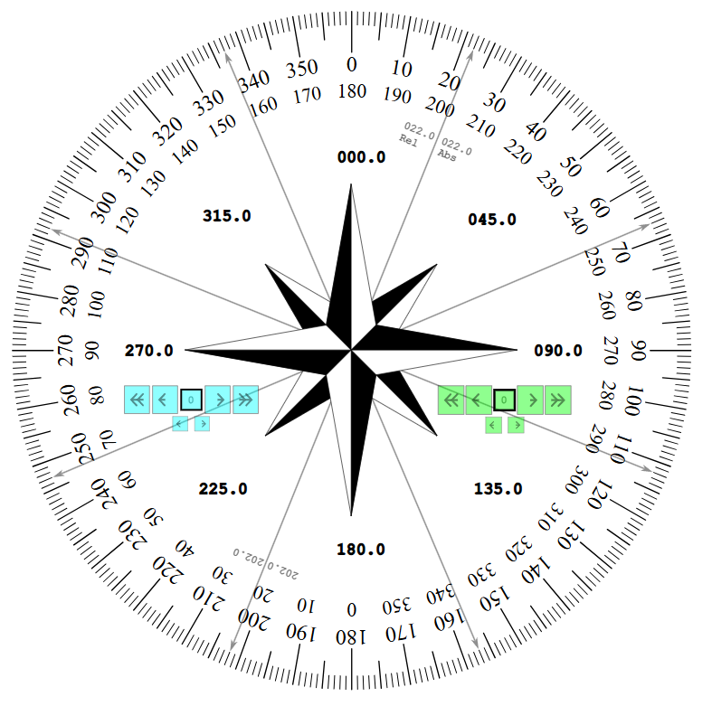

# airportTrafficPatternCompass

## Introduction
An interactive compass to generate the headings of travel in the four legs of an Airport Traffic Pattern.

Although experienced pilots can find their way around the navigational instruments with a single glance, inexperienced pilots can use this tool during their training sessions. 

The compass offers three independent layers which can be used for multiple navigation purposes, as described in the examples below.

## Installation
Copy onto a local folder the two files:
 - airportTrafficPatternCompass.html
 - svg.min.js
 
The two files must reside in the same folder. No internet connection is required.

# How to use
The interactive compass offers three individual compass layers that can be used in conjunction.

## The plate layer
This is the normal compass flat surface. It comprises of:
 - the outer scale offers the normal markings, starting from 0 at the top, going to 359 on a clockwise direction
 - the inner scale shows the reciprocal direction of the outer scale. If you want to travel at the opposite side of 10 degrees, you can see directly that the reciprocal value is 190 degrees. This is a useful features when adding 180 degrees goes beyond 360, where you woudl have to either divide by 360 and keep the remainder, or subtract 180 from the original value. Too complex, especially when you are tired or stressed by other priority activities.

You may use the buttons at the right side of the compass to rotate the layer by -5, -1, -1/2, +1/2, +1, +5 degrees.
The 0 button returns the plate to its original position.

## The eight points of the horizon layer 
This layer presents directly the bearings of the eight points of the horizon, relative to the plate layer. This layer is fixed and cannot be rotated. 

You can use this layer in conjunction with the plate layer. For example, consider the case where you want to find the headings when flying a traffic pattern on a runway. 

For example, the 03/21 runway of airport LGAV is oriented to 37 degrees North. Rotate the plate layer to the left, so that the top of the scale layer points to 37. The eight points now show the cardinal directions of 37, 217 on the bottom side,   307 to the left and 127 to the right, as well as the intermeddiate values of the remaing four points. Using this functionality, you know immediately that you depart at 37 degrees, turn left to the cross-wind leg at 307 degrees, turn left for the downwind leg at 217 degrees, turn left to the base leg at 127 degrees, and finally turn left to the final leg at 37 degrees.

## The arrow layer
This layer can be rotated indipendently from the plate layer, making possible the calculation of differences.

The top and bottom arrows present two numbers:
  - the `Rel` number shows the position of the arrow relative to the plate scale
  - the `Abs` number shows the position of the arrow, considering that the top side of the compass is oriented to 0.

  
One application could be to consider the plate layer as the True North of a compass rose and the arrow layer as the Magnetic North. For example, consider a magnetic declination of 6 degrees West. Rotate the plate layer so that the top scale is oriented to 354 degrees. Now, the `Rel` and `Abs` numbers can make a direct conversion from True to Magnetic, and from Magnetic to True. The `Rel` value shows True heading and the `Abs` value shows Magnetic heading. Consider for example that you use the compass and take a bearing of 82 degrees. Rotate the arrow layer so that the `Abs` values shows 82. The true heading is shown in the `Rel`, as 76 degrees. Next, you plot on map a true heading of 45 degrees. Rotate the arrow layer so that `Rel` shows 45 and read the `Abs` value for a magnetic heading of 51 degrees.   

You may use the buttons at the right side of the compass to rotate the layer by -5, -1, -1/2, +1/2, +1, +5 degrees.
The 0 button returns the plate to its original position.

## Attributions

The original sources are stored in folder `attributed`.

File: Windrose_en.svg
By <a href="//commons.wikimedia.org/w/index.php?title=User:Vloeck&amp;action=edit&amp;redlink=1" class="new" title="User:Vloeck (page does not exist)">User:Vloeck</a> - Adapted from , <a href="https://creativecommons.org/licenses/by-sa/3.0" title="Creative Commons Attribution-Share Alike 3.0">CC BY-SA 3.0</a>, <a href="https://commons.wikimedia.org/w/index.php?curid=148344153">Link</a>
Licensed under:
CC BY-SA 3.0

Usage and modifications: Using the design of the internal diamond, pointing to the 8 points of the horizon

File: Protractor1.svg
URL: https://commons.wikimedia.org/wiki/File:Protractor1.svg
Description	A 360 degrees protractor with graduations in degree
Date	2 Δεκεμβρίου 2007
Source	Personal work, based on a public domain licensed file, downloaded from Wikipedia (Image:Protractor.svg)
Creator:	Georges Khaznadar <georgesk@ofset.org>
Licensed under:
1. GNU GPL 1.2 or later
2.   GNU Free Documentation License, Version 1.2 or any later version published by the Free Software Foundation; with no Invariant Sections, no Front-Cover Texts, and no Back-Cover Texts. A copy of the license is included in the section entitled GNU Free Documentation License.

Usage and modifications: Using the SVG design of exploiting the duplication feature

File: svg.min.js
URL: https://svgjs.dev/docs/3.2/acknowledgements-thanks/
Licensed under:
SVG.js and its documentation are released under the terms of the MIT License.

Usage and modifications: Using the features to make an svg interactive

Working after the above sources, I added the buttons and interactivity to the protractors, as well as created all additional layers. 

## Licensing

My work is licensed under the not-so restrictive `MIT license`, with the purpose of indemnifying me against any potential damages. 
  
If someone wishes to use this work and finds this licensing scheme restrictive for a particular use, feel free to contact me. 

## Developer notes
I made every attempt to keep all interactivity functions within the SVG file, aiming at maintaining only the svg file itself. Later, I discovered that it was problematic to open an svg directly in certain moble phones, so I had to include the svg inside an HTML. This means that I could also design the buttons and other features outside the svg, using better-looking buttons, instead of the rudimentary rectangles of svg. Yet, I kept the original thought.

In addition, I would like to have the interactivity features included in the html file. I tried to add the content of svg.min.js inside a script, but this was not possible. In a future release, I could skip entirely the svg.min.js and implement the rotation with Javascript. The only other feature that is offered by svg.min.js is the animation of the rotation, but I need to decide if it is absolutely necessary.

